


 


 


Full-Stack AI Engineer and undergraduate researcher building AI-powered systems and publishing
empirical research on AI-agent software security. I work across the stack, React and Next.js on
the front end, Node.js and PostgreSQL on the back, and spend most of my attention on the part in
between: making sure the AI agents sitting on top of that stack cannot be talked into doing
something they were not authorized to do.

That interest turned into Warrant, a security layer that stopped 60 out of 60 tuned attacks against
AI agents in a measured adversarial lab, and into two empirical studies on how AI-authored code
introduces risk at scale, one of them analyzing 17,727 merged pull requests.

- 🔭 Currently building **RAG and agentic systems** as a Full Stack Developer at **Placentek**
- 🛡️ Currently researching **AI-agent software security**, provenance-based tool authorization and dependency risk
- 🎓 Leading AI initiatives as **AI Lead** at the **AWS Student Builder Group, COMSATS University Islamabad**
- 📍 Based in **Islamabad, Pakistan**, BS Computer Science, class of 2027
- 💬 Ask me about **AI agent security, MCP, RAG pipelines, or prompt-injection defense**

 


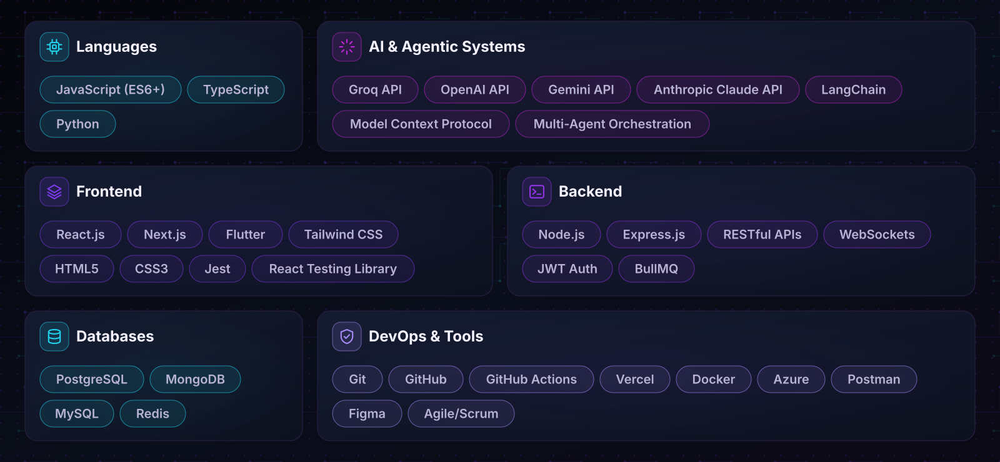

 



 


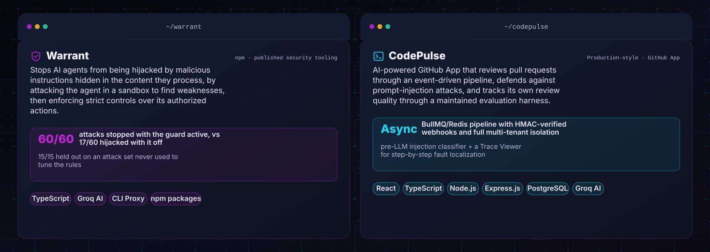

|                                                        Warrant                                                         |                                                         CodePulse                                                          |
| :----------------------------------------------------------------------------------------------------------------------: | :----------------------------------------------------------------------------------------------------------------------: |
|   |   |

 


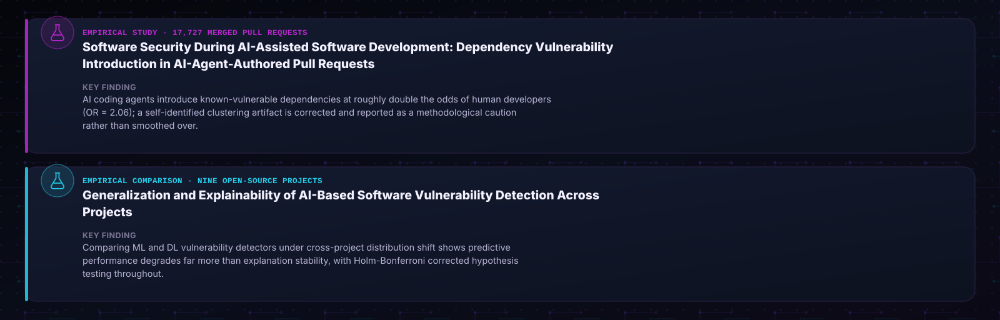

 


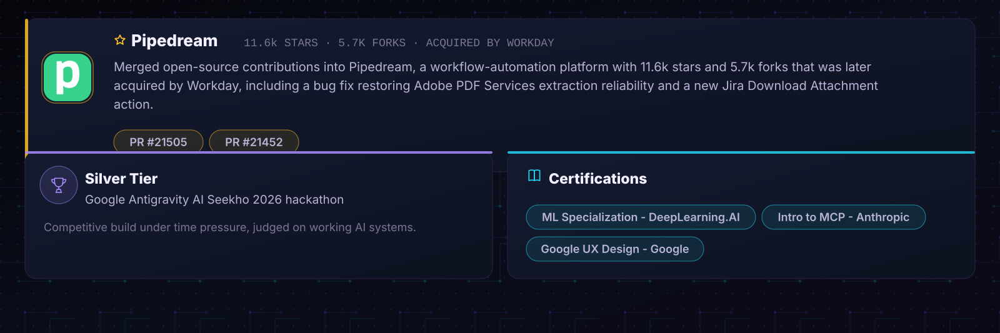

 


 


I'm always up for a conversation about agent security, RAG systems in production, or a gnarly
debugging story. Reach out, I read everything that lands in these inboxes.

